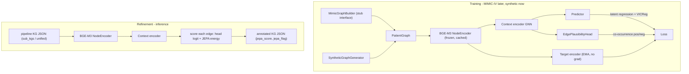

# Graph-JEPA Refinement Layer

A consistency-scoring layer that runs after the multi-agent pipeline. It reads the existing KG JSON, embeds nodes in a shared BGE-M3 space, runs a hybrid Graph-JEPA to produce context-aware node latents, and annotates each candidate edge with a plausibility score + flag. It never adds or (by default) removes facts.

## Confirmed design

- Shared node space: frozen BGE-M3 embedding of `"{TYPE}: {text}"` for both MIMIC and pipeline graphs (same encoder family used by `dump_graph` entity resolution).
- Hybrid JEPA: relation-agnostic structural masked-latent prediction (the JEPA objective) + a lightweight typed-edge plausibility head over the 6 relations.
- Output: edges gain `jepa_score` in `[0,1]` and `jepa_flag` (`weak`/`inconsistent`); pruning is an opt-in flag, off by default.

## Data contract (already verified)

Per-transcript and unified KGs share: nodes `{id, text, type, evidence, turn_id}` and edges `{source_id, target_id, type, evidence, turn_id}` (unified adds `occurrences`/`res_id`). The refinement layer round-trips this exact shape and only adds fields to edges.

7 node types: `SYMPTOM, DIAGNOSIS, TREATMENT, PROCEDURE, LOCATION, MEDICAL_HISTORY, LAB_RESULT`.
6 edge types: `CAUSES, INDICATES, LOCATED_AT, RULES_OUT, TAKEN_FOR, CONFIRMS`.

## Flow

## Modules (new package `src/graph_jepa/`)

- `schema.py`: `PatientGraph` dataclass + node/edge type enums; `from_pipeline_json()` / `to_pipeline_json()` that preserve all existing fields and attach `jepa_score`/`jepa_flag` to edges. Consumes the format in [outputs/cooperative_20_enriched_v2/sub_kgs/RES0198_cooperative_multi_agent_enriched_v2.json](outputs/cooperative_20_enriched_v2/sub_kgs/RES0198_cooperative_multi_agent_enriched_v2.json).
- `encoders.py`: `BgeNodeEncoder` (frozen BGE-M3 via FlagEmbedding, on-disk cache keyed by `(type,text)` hash) + `MockEncoder` (deterministic vector, no downloads) so dev/CI runs without the model or data.
- `data.py`: PyG `PatientGraphDataset`; `SyntheticGraphGenerator` (typed nodes from a small clinical vocab + co-occurrence edges, plausible patient states); `MimicGraphBuilder` documented stub with a frozen interface mapping `diagnoses_icd->DIAGNOSIS`, `prescriptions->TREATMENT`, `labevents->LAB_RESULT`, `procedures_icd->PROCEDURE` (+ notes-derived symptom/history as optional), co-occurrence/temporal edges.
- `model.py`: `GraphEncoder` (GINE/GAT), EMA target encoder, `Predictor`, relation-agnostic `subgraph_mask()` (random connected region now, temporal-aware later), JEPA latent loss + VICReg anti-collapse term, and `EdgePlausibilityHead(z_src, z_tgt, relation_emb)->logit`.
- `config.py`: dataclasses for model/train/score hyperparameters.
- `train.py`: EMA + AdamW loop, checkpointing, CLI `python -m graph_jepa.train --data {synthetic|mimic} --out checkpoints/`.
- `score.py`: loads checkpoint+encoder; per edge combines edge-head logit with a JEPA energy (distance between predicted and target-encoder latent of the masked endpoint region) into `jepa_score`; flags low scores; never adds edges; optional `--prune-threshold`. CLI `python -m graph_jepa.score --input <dir-or-json> --checkpoint ... --output ...`.

## Integration & docs

- Add an optional Step 4 to [run_pipeline.sh](run_pipeline.sh) invoking `graph_jepa.score` on the unified graph.
- Add torch, torch-geometric, FlagEmbedding (BGE-M3), numpy to [requirements.txt](requirements.txt) (heavy; `MockEncoder` path avoids them during early dev).
- New `GRAPH_JEPA_README.md` mapping the theory to modules and documenting the MIMIC plug-in contract.

## Verification (no real data yet)

1. Synthetic generator -> train a few epochs -> verify JEPA loss decreases AND latent variance stays > 0 (no collapse).
2. Run `graph_jepa.score` on `RES0198` sub-KG -> verify output round-trips, node/edge counts unchanged, every edge has `jepa_score`/`jepa_flag` (no facts added/removed).
3. Swap `--data mimic`: builder raises a clear, documented `NotImplementedError` until tables are provided, with the interface unchanged.
</plan>
<parameter name="todos">[{"id": "schema", "content": "Create src/graph_jepa/schema.py: PatientGraph dataclass, type enums, from/to pipeline JSON round-trip preserving fields and adding jepa_score/jepa_flag to edges"}, {"id": "encoders", "content": "Create src/graph_jepa/encoders.py: frozen BGE-M3 BgeNodeEncoder with on-disk cache + deterministic MockEncoder fallback"}, {"id": "data", "content": "Create src/graph_jepa/data.py: PyG dataset, SyntheticGraphGenerator, and MimicGraphBuilder stub with fixed interface and documented MIMIC-IV table mapping"}, {"id": "model", "content": "Create src/graph_jepa/model.py: context/EMA-target encoders, predictor, subgraph masking, JEPA latent loss + VICReg, and EdgePlausibilityHead"}, {"id": "config", "content": "Create src/graph_jepa/config.py: model/train/score hyperparameter dataclasses"}, {"id": "train", "content": "Create src/graph_jepa/train.py: EMA+AdamW training loop, checkpointing, CLI over synthetic/mimic data sources"}, {"id": "score", "content": "Create src/graph_jepa/score.py: inference scorer combining edge-head + JEPA energy, annotate-only with optional prune, CLI over KG JSON"}, {"id": "integration", "content": "Add optional Step 4 to run_pipeline.sh, update requirements.txt, and write GRAPH_JEPA_README.md (theory-to-code + MIMIC plug-in contract)"}, {"id": "verify", "content": "Verify: train on synthetic (loss down, no collapse) and score RES0198 sub-KG (round-trips, counts unchanged, scores present)"}]